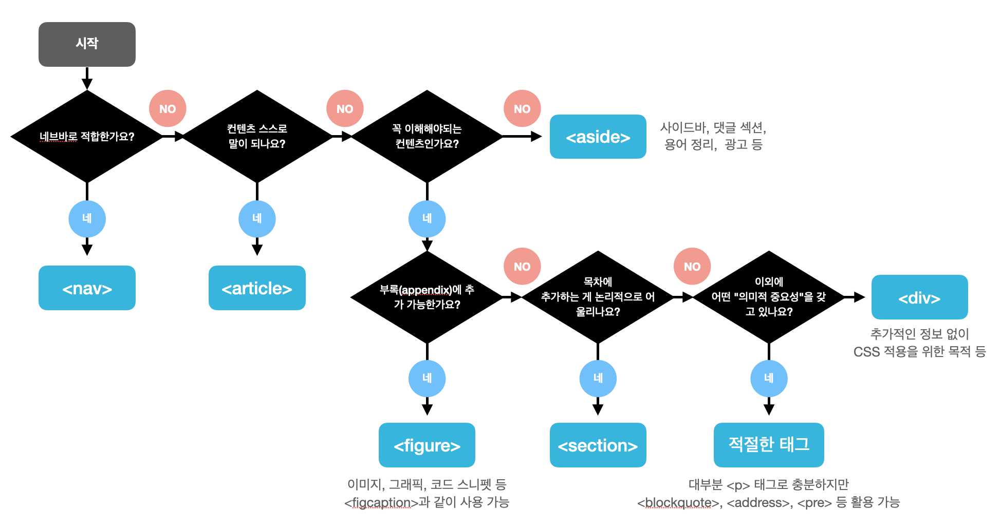

# 시맨틱 태그 (Semantic Tags)

## 시맨틱 태그 고르기

> 원본: [HTML5 Element Flowchart](http://html5doctor.com/resources/)




## 섹션 (section)

- 섹션 태그는 **문서의 섹션을 정의할 때 사용**

- W3C 문서에서 따르면 "**섹션**"이란, **"보통 헤딩과 함께 작성되는 컨텐츠들로써 의미적으로 함께 묶을 수 있는 것들"**로 볼 수 있음

```html
<section>
  <h1>The origin of coffee</h1>
  <p>The origin of coffee is ...</p>
</section>
```


## 아티클 (article)

- 아티클 태그는 어떤 컨텐츠가 **"독립적이고 태그에 담기는 내용 그 자체로 완전할 때 (self-contained)"** 사용

- 즉, 아티클 태그에 담기는 컨텐츠는 전체 문서의 다른 컨텐츠들과 상관 없이 그 자체로 말이 되고 의미가 있어야함

```html
<article>
  <h1>어떤 기사 제목</h1>
  <p>기사 내용...</p>
</article>
```


## 아티클과 섹션 중첩해서 사용하기

- **아티클** **안에** **섹션** 태그 사용 (ok)
- **아티클 안에** **아티클** 태그 사용 (ok)
- **섹션 안에** **아티클** 태그 사용 (ok)
- **섹션 안에** **섹션** 태그 사용 (ok)

```html
<section>
  <p>주요 뉴스</p>
  <section>
    <h1>스포츠 뉴스 섹션</h1>
    <article>
      <section id="introduction">스포츠 기사 서론</section>
      <section id="body">스포츠 기사 본론 </section>
      <section id="conclusion">스포츠 기사 결론</section>
    </article>
  </section>
    <section>
    <h1>과학 뉴스 섹션</h1>
    <article>
      <section id="introduction">과학 기사 서론</section>
      <section id="body">과학 기사 본론 </section>
      <section id="conclusion">과학 기사 결론</section>
    </article>
  </section>
</section>
```


## 헤더 (header)

- 전체 문서 또는 특정 섹션의 **제목에 사용되는 태그** 
- 주로 어떤 컨텐츠의 도입부에 사용되는 것이 적절함

```html
<article>
  <header>
    <h1>시맨틱 태그의 역할은 무엇일까요?</h1>
  </header>
  <p>본론...</p>
</article>
```


## 푸터 (footer)

- 전체 문서 또는 특정 섹션의 **푸터에 사용되는 태그** 
- **푸터는 보통 문서의 작성자, 저작권 정보, 이용약관, 연락처 등의 메타 정보를 담고있음**

```html
<footer>
  <p>법인명(상호): 주식회사 프론트엔드 치트시트</p>
  <p>주소: 서울특별시 개발구 프론트엔드로</p>
</footer>
```


## 네브 (nav)

- 네비게이션 링크를 담는 태그

```html
<nav>
    <ul>
      <li><a href="/home">home</a></li>
      <li><a href="/about">about</a></li>
      <li><a href="/contact">contact</a></li>
    </ul>
  </nav>
```


## 어사이드 (aside)

- **문서 전체의 흐름과 크게 관계 없는 컨텐츠에 적합**
- 사이드바, 광고, 날씨 정보 등에 사용 가능

```html
<aside>
  <nav>
    <ul>
      <li><a href="/home">home</a></li>
      <li><a href="/about">about</a></li>
      <li><a href="/contact">contact</a></li>
    </ul>
  </nav>
</aside>
```


## 피규어 그리고 피그캡션 (figure & figcaption)

- 피규어(figure) 태그는 주로 이미지, 그래픽, 코드 스니펫 등을 나타내기 위해 사용됨
- 피그캡션(figcaption) 태그를 사용하여 캡션을 추가할 수 있음
- 부록으로 옮길 수 있는 컨텐츠에 적합

```html
<!-- 이미지만 사용 -->
<figure>
  
</figure>

<!-- 이미지와 캡션 -->
<figure>
  
  <figcaption>귀여운 고양이</figcaption>
</figure>

<!-- 코드 스니펫 -->
<figure>
  <figcaption>Get browser details using <code>navigator</code>.</figcaption>
  <pre>
    function NavigatorExample() {
      var txt;
      txt = "Browser CodeName: " + navigator.appCodeName + "; ";
      txt+= "Browser Name: " + navigator.appName + "; ";
      txt+= "Browser Version: " + navigator.appVersion  + "; ";
      txt+= "Cookies Enabled: " + navigator.cookieEnabled  + "; ";
      txt+= "Platform: " + navigator.platform  + "; ";
      txt+= "User-agent header: " + navigator.userAgent  + "; ";
      console.log("NavigatorExample", txt);
    }
  </pre>
</figure>
```


## 타임 (time)

- datetime 속성을 통해 기계 친화적인 형식으로 시간을 지정할 수 있음
- 검색 엔진 최적화에 유용함

```html
<time datetime="2021-12-01T01:49:41Z">
  8시간 전
</time>
```

